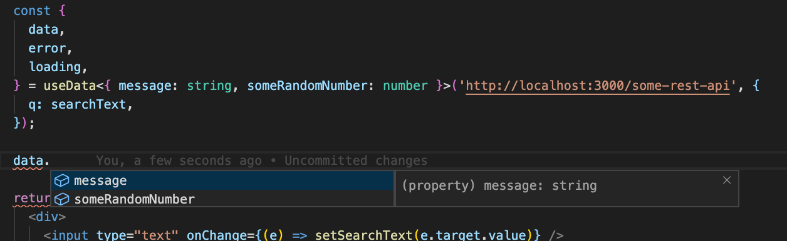

`react-isomorphic-data` provides TypeScript support out of the box. When using hooks, you can define the shape of the expected returned data, and if your IDE supports intellisense, everything will just work!

```javascript
interface DataFromAPI {
  message: string;
  someRandomNumber: number;
}

const SearchInput = () => {
  const {
    data,
    error,
    loading,
  } = useData<DataFromAPI>('http://localhost:3000/some-rest-api');

  return (
    <div>{data.message} | {data.someRandomNumber}</div>
  );
};
```



When using HOCs, simply define the props of your component like how you would normally do it in a React code.
